# Let's Build a Fully Automated CI/CD Pipeline on AWS ECS Fargate Using CodePipeline, CodeBuild, CodeDeploy, and GitHub

> Documentation for a fully automated CI/CD pipeline on AWS that builds and deploys a containerized web application.

**Services used:** `GitHub` · `AWS CodePipeline` · `AWS CodeBuild` · `Amazon ECR` · `Amazon ECS (Fargate)` · `Elastic Load Balancing` · `AWS IAM` · `Amazon CloudWatch`
**Languages and formats:** `Dockerfile` · `HTML` · `YAML (buildspec)` · `JSON (IAM policies, imagedefinitions)`
**Flow:** `GitHub → CodeBuild → Amazon ECR → ECS Fargate`

---

## Table of Contents

1. [Activity One: Project Setup](#activity-one-project-setup)
2. [Clone the GitHub Repository](#clone-the-github-repository)
3. [Creating Project Files in Visual Studio Code](#creating-project-files-in-visual-studio-code)
4. [ACTIVITY TWO: Continuous Integration: Setting Up ECR and AWS CodeBuild](#activity-two-continuous-integration-setting-up-ecr-and-aws-codebuild)
5. [Create an Elastic Container Registry (ECR)](#create-an-elastic-container-registry-ecr)
6. [Setting Up the AWS CodeBuild Project](#setting-up-the-aws-codebuild-project)
7. [Build Security and Permissions](#build-security-and-permissions)
8. [Activity Three: Pipeline Creation](#activity-three-pipeline-creation)
9. [Source Stage](#source-stage)
10. [Build Stage](#build-stage)
11. [Test Stage (Optional)](#test-stage-optional)
12. [Deploy Stage](#deploy-stage)
13. [Test the Pipeline](#test-the-pipeline)
14. [Configure an Application Load Balancer (ALB)](#configure-an-application-load-balancer-alb)
15. [Create a Fargate Cluster](#create-a-fargate-cluster)
16. [Create Task and Container Definitions](#create-task-and-container-definitions)
17. [Deploy to ECS: Create a Service](#deploy-to-ecs-create-a-service)
18. [Verify Deployment](#verify-deployment)
19. [Add Deploy Stage to CodePipeline](#add-deploy-stage-to-codepipeline)
20. [Test the Automated Deployment](#test-the-automated-deployment)

---

## Overview


We'll learn together how to set up a fully automated CI/CD pipeline on AWS using GitHub for source control, AWS CodePipeline, CodeBuild, Amazon ECR, and Amazon ECS with Fargate. The pipeline automatically builds and deploys a containerized web application.

Before we begin, let's explore some **Core ECS Concepts**:

**ECS Task Definition**
A task definition is a JSON template that describes how your container should run. It specifies:

**Docker image (stored in Amazon ECR)**
CPU and memory allocation
Networking mode and ports
Environment variables and secrets
IAM roles for accessing AWS services

**ECS Task (The Running Container)**
A task is a live instance of a task definition. When a task starts, AWS Fargate automatically provisions the required compute resources. No EC2 management needed.

**ECS Service (The Manager)**

An ECS service ensures a fixed number of tasks are always running. During deployments, it replaces old tasks with new ones using the updated image, enabling zero-downtime releases.

**ECS Cluster (The Logical Group)**
A cluster is a logical container for ECS services and tasks. With Fargate, the cluster exists mainly for organization. AWS handles all underlying infrastructure.

**AWS Fargate (Serverless Compute)**
Fargate is the serverless compute engine for ECS. It runs containers without requiring you to manage servers, instances, or scaling policies.

**Elastic Container Registry (ECR)**
Amazon ECR is a managed Docker image registry. CodeBuild pushes images here, and ECS pulls them during deployments.

**IAM Roles for ECS Tasks**
IAM roles define what AWS services your containers can access, such as S3, DynamoDB, or CloudWatch, without storing credentials in code.

---

## Activity One: Project Setup

This section walks you through building and deploying the application from scratch.

Before you begin, kindly make sure you have the following:

1. An **AWS account:** If you don't have an AWS account yet, you can create one in just a few minutes using the AWS Free Tier.

Go to the AWS website and click Create an AWS Account.
Enter your email address, set an account name, and create a password.

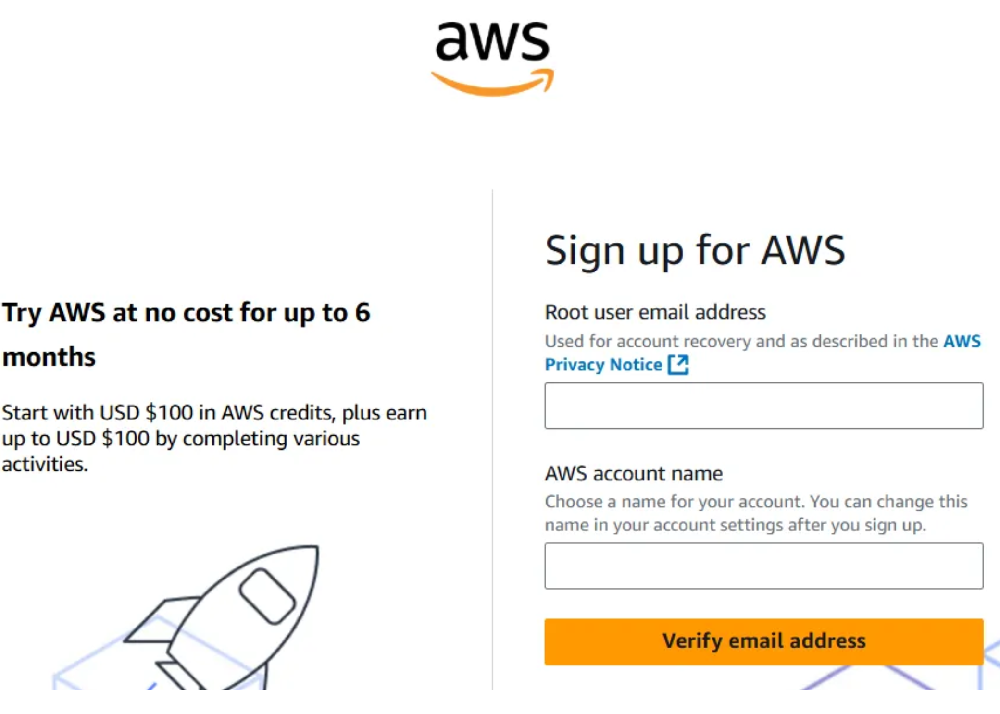

Add your contact information and a valid payment method (required, but still free Tier eligible).
Verify your phone number.
Choose the Basic Support Plan (free).

2. An **IAM role** with **permissions** for:

AWS CodePipeline
AWS CodeBuild
Amazon ECR
Amazon ECS

**3. Docker installed on your local machine:**

Go to the **Docker website** and download **Docker Desktop**.

Install it for your operating system (Windows, macOS, or Linux).

Start Docker and confirm installation by running `docker --version` in your terminal.

4. A **GitHub repository** containing: *'Dockerfile', 'app.py' or 'index.html', 'buildspec.yml', and ECS task definition JSON file*. ***We'll create these files soon.***

To create the repo, Sign in to GitHub.
Click New Repository.
Enter a project name (for example, `cicd-project`).
Add a short description and choose if you want the repo Public or Private.
Select Add a README file (recommended).
Click Create Repository.

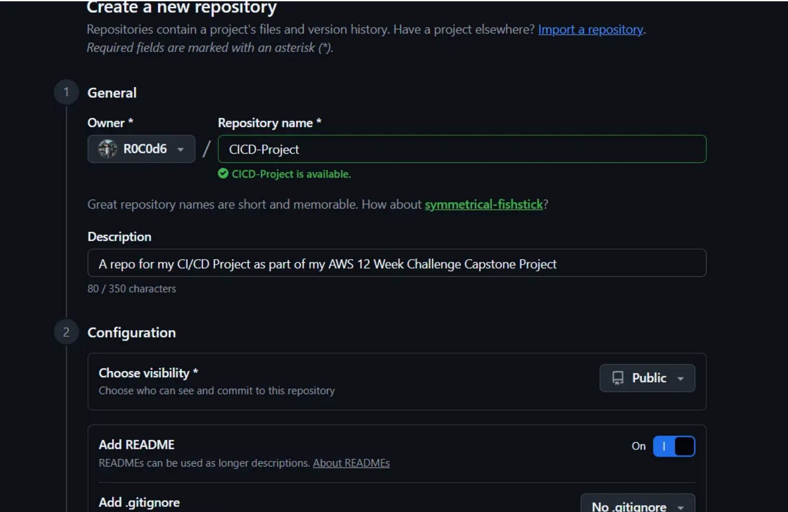

---

## Clone the GitHub Repository

Before creating any application files, start by cloning the GitHub repository to your local machine.

This ensures that all files you create in Visual Studio Code, such as *'index.html'*, *'Dockerfile'*, and *'buildspec.yml',* are automatically linked to GitHub for version control and CI/CD integration.

**Clone the repository:** Cloning the repo first keeps your local work synced with GitHub from day one, making AWS CodePipeline setup much smoother later.

```bash
# Clone your GitHub repository to your local machine
git clone https://github.com/<your-username>/CICD-Project.git
```

**Open the project in VS Code**

```bash
# Navigate into the cloned project folder
cd CICD-Project
```

You can now create your project files (**'index.html', 'Dockerfile', 'buildspec.yml'**) and the **'container/'** folder for images inside this repository.

---

## Creating Project Files in Visual Studio Code

After cloning your GitHub repository, open it in Visual Studio Code and create the following:

1. **'index.html'**: the web page for your app.

```html
<!DOCTYPE html>
<html>
 <head>
  <!-- Page title shown in browser tab -->
  <title>Week 12 Capstone CICD</title>
 </head>
 <body>
  <!-- Centered main heading for the web page -->
  <center>
   <h1>AWS CI/CD for Week 12: Container Deployment for the 12-Week Challenge</h1>
  </center>

  <!-- Section containing cat images inside containers -->
  <section id="photos">
   
   
   
   
   
   
  </section>

 </body>
</html>
```

2. **'Dockerfile':** defines how your container is built.

```dockerfile
# Use the latest official Nginx image from the public ECR registry
FROM public.ecr.aws/nginx/nginx:latest

# Add metadata about the image maintainer
LABEL maintainer="Animals4life"

# Copy the main HTML file into the default Nginx web directory
COPY index.html /usr/share/nginx/html

# Copy all cat images from the container folder into the Nginx web directory
COPY containerandcat*.jpg /usr/share/nginx/html/

# Expose port 80 to allow web traffic into the container
EXPOSE 80

# Start Nginx in the foreground so the container keeps running
CMD ["nginx", "-g", "daemon off;"]
```

3. **'buildspec.yml':** tells CodeBuild how to build and push the Docker image.

```yaml
version: 0.2
phases:
  pre_build:
    commands:
      - echo Logging in to Amazon ECR...   # Authenticate Docker to ECR
      - >
        aws ecr get-login-password --region $AWS_DEFAULT_REGION | docker login
        --username AWS --password-stdin
        $AWS_ACCOUNT_ID.dkr.ecr.$AWS_DEFAULT_REGION.amazonaws.com
      - >
        REPOSITORY_URI=$AWS_ACCOUNT_ID.dkr.ecr.$AWS_DEFAULT_REGION.amazonaws.com/$IMAGE_REPO_NAME
      - COMMIT_HASH=$(echo $CODEBUILD_RESOLVED_SOURCE_VERSION | cut -c 1-7)
      - IMAGE_TAG=${COMMIT_HASH:=latest}
  build:
    commands:
      - echo Build started on `date`
      - echo Building the Docker image...   # Build Docker image with tags
      - docker build -t $REPOSITORY_URI:latest -t $REPOSITORY_URI:$IMAGE_TAG -f container/Dockerfile ./container
  post_build:
    commands:
      - echo Build completed on `date`
      - echo Pushing the Docker image...    # Push image to ECR
      - docker push $REPOSITORY_URI:latest
      - docker push $REPOSITORY_URI:$IMAGE_TAG
      - echo Writing image definitions file...   # Create imagedefinitions.json for CodeDeploy
      - >
        printf '[{"name":"%s","imageUri":"%s"}]' "$IMAGE_REPO_NAME"
        "$REPOSITORY_URI:$IMAGE_TAG" > imagedefinitions.json

artifacts:
  files:
    - imagedefinitions.json   # Output artifact for CodePipeline
```

**4. 'container/' folder:** stores images images for the webpage.

**File & Folder Structure**

```
CICD-Project/
│
├── container/
│ ├── containerandcat1.jpg
│ ├── containerandcat2.jpg
│ ├── containerandcat3.jpg
│ ├── containerandcat4.jpg
│ ├── containerandcat5.jpg
│ └── containerandcat6.jpg
│
├── Dockerfile
├── index.html
└── buildspec.yml
```

These files form the foundation of your CI/CD pipeline.

Once committed to GitHub, they will flow automatically through **CodePipeline → CodeBuild → CodeDeploy → ECS Fargate**, creating a live, containerized web application on AWS.

**Push Your Code to Github**

Once your project files are ready, follow these steps to upload them to GitHub.

```bash
# Check the status of your changes
git status

# Stage all files for commit
git add .

# Commit the changes with a message
git commit -m "Initial commit with project files"

# Push to your GitHub repository
git push origin main
```

Pushing your code connects your local project to GitHub and triggers the AWS CI/CD pipeline once CodePipeline is set up.

---

## ACTIVITY TWO: Continuous Integration: Setting Up ECR and AWS CodeBuild

### Create an Elastic Container Registry (ECR)

**Goal:** Configure AWS CodeBuild to build Docker images automatically and push them to a secure ECR repository.

**Why:** A private ECR repository keeps your container images secure, allowing only authorized AWS services like CodeBuild and ECS to access them.

**Steps:**

1. Open the Amazon ECR Console and click **Create Repository.**

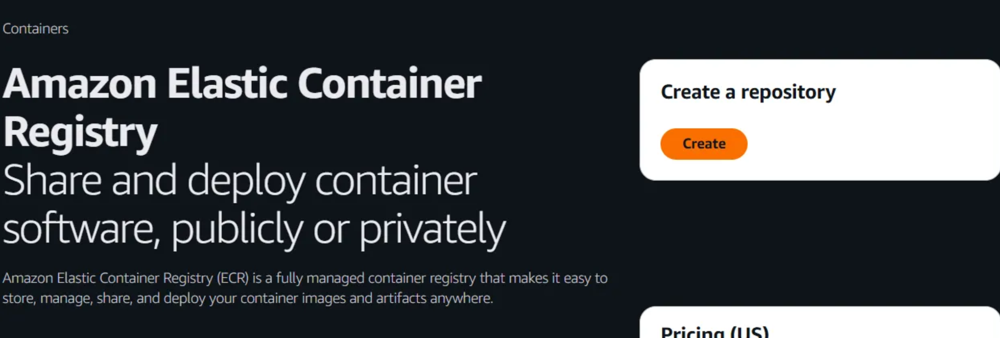

2. Enter a unique repository name, e.g., 'ecr_catepipeline'.

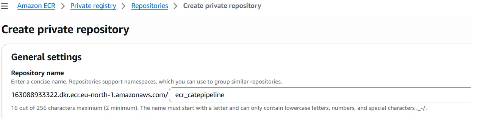

3. Leave other settings at default.

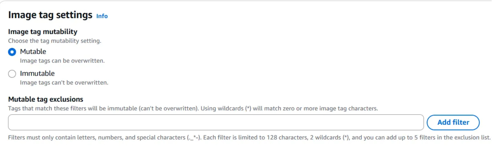

5. Click Create.

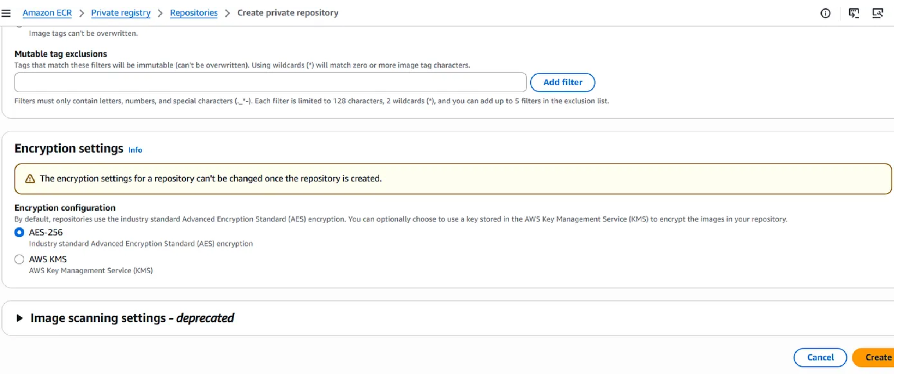

6. Copy the Repository URI. You'll need this as an environment variable in CodeBuild.

This ECR repository will store all Docker images for your CI/CD pipeline.

---

## Setting Up the AWS CodeBuild Project

Let's follow these steps to create a CodeBuild project for building and pushing Docker images:

Search For and Open up **Codebuild:**

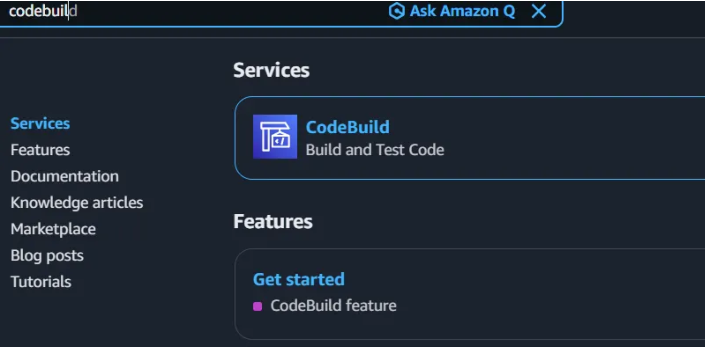

**Name It:** e.g. buid_catepipeline

**Project Type:** Default Project

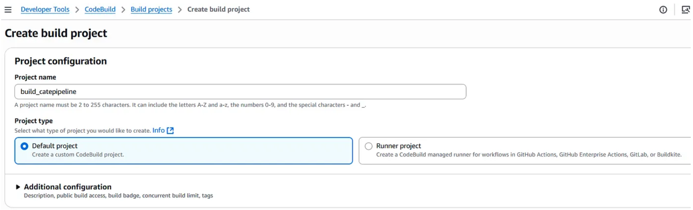

**Source:**

**Connect your GitHub repository**

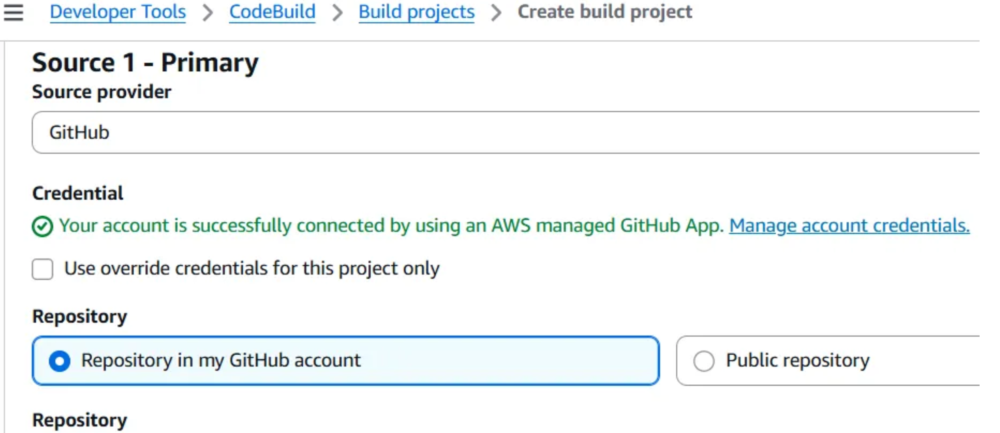

**Enable webhook integration so builds trigger automatically on code push**

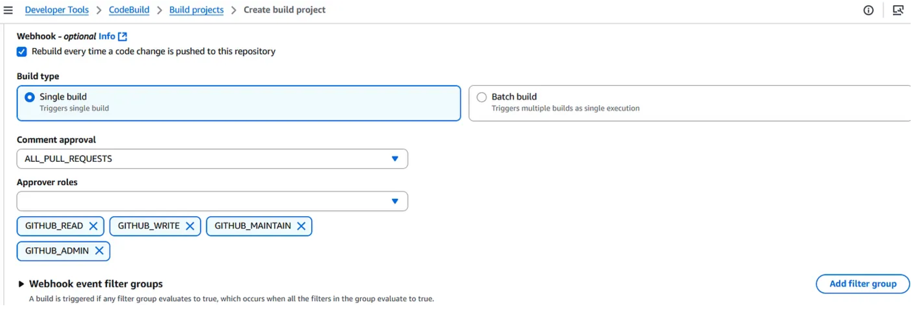

I added a **Filter Group**:

**Event Type:** Push

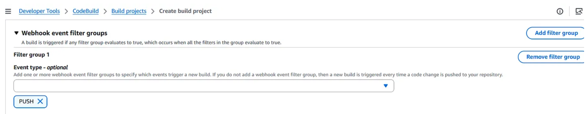

**Environment image:** Managed image → Amazon Linux 2
**Runtime:** Standard
**Privileged mode:** Enabled (needed for Docker-in-Docker)

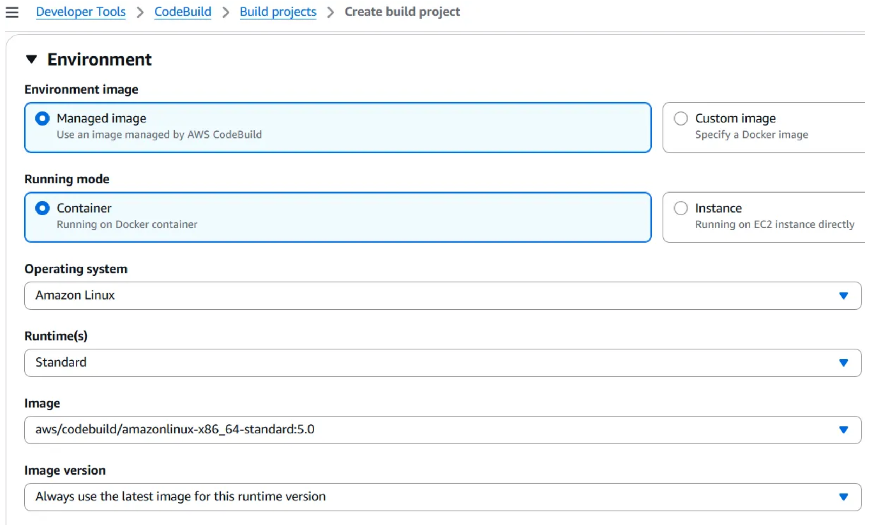

**Create a New Service Role and Name it:**

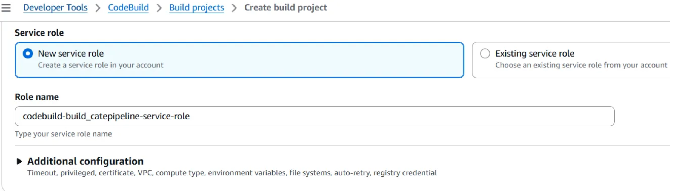

**Buildspec:** Use your existing *'buildspec.yml'* to build the Docker image and push it to ECR. **e.g.:**

```yaml
version: 0.2

phases:
  pre_build:
    commands:
      # Log in to Amazon ECR
      - echo Logging in to Amazon ECR...
      - aws ecr get-login-password --region $AWS_DEFAULT_REGION | docker login --username AWS --password-stdin $AWS_ACCOUNT_ID.dkr.ecr.$AWS_DEFAULT_REGION.amazonaws.com
      # Define repository URI and image tag
      - REPOSITORY_URI=$AWS_ACCOUNT_ID.dkr.ecr.$AWS_DEFAULT_REGION.amazonaws.com/$IMAGE_REPO_NAME
      - COMMIT_HASH=$(echo $CODEBUILD_RESOLVED_SOURCE_VERSION | cut -c 1-7)
      - IMAGE_TAG=${COMMIT_HASH:=latest}

  build:
    commands:
      - echo Build started on `date`
      - echo Building Docker image...
      - docker build -t $REPOSITORY_URI:latest -t $REPOSITORY_URI:$IMAGE_TAG -f container/Dockerfile ./container

  post_build:
    commands:
      - echo Build completed on `date`
      - echo Pushing Docker image to ECR...
      - docker push $REPOSITORY_URI:latest
      - docker push $REPOSITORY_URI:$IMAGE_TAG
      - echo Creating imagedefinitions.json for CodeDeploy...
      - printf '[{"name":"%s","imageUri":"%s"}]' "$IMAGE_REPO_NAME" "$REPOSITORY_URI:$IMAGE_TAG" > imagedefinitions.json

artifacts:
  files:
    - imagedefinitions.json   # Output artifact for CodePipeline
```

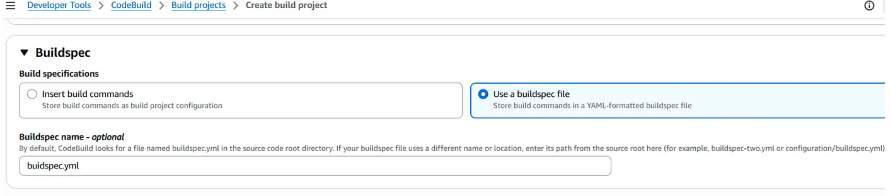

**Artifacts:** Select No artifacts (Docker image is pushed directly to ECR)

**Logs:** Optionally enable CloudWatch Logs for monitoring and troubleshooting

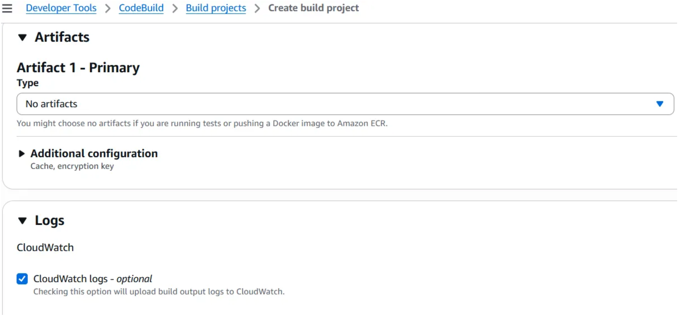

**Keep all remaining configurations at default**

This setup ensures that every GitHub push automatically triggers CodeBuild to create and push Docker images to your secure ECR repository.

---

## Build Security and Permissions

To allow your CodeBuild project to push Docker images to Amazon ECR, you need to attach the proper IAM permissions.

**Steps:**

Go to the IAM Console → Roles.

Find the role created for your CodeBuild project.

Click Permissions → Add permissions → Create inline policy.

Switch to the JSON editor and replace the content with the following policy or similar you created:

```json
{
    "Version": "2012-10-17",
    "Statement": [
        {
            "Effect": "Allow",
            "Action": [
                "ecr:GetAuthorizationToken",
                "ecr:BatchCheckLayerAvailability",
                "ecr:PutImage",
                "ecr:InitiateLayerUpload",
                "ecr:UploadLayerPart",
                "ecr:CompleteLayerUpload",
                "ecr:DescribeRepositories",
                "ecr:CreateRepository"
            ],
            "Resource": "*"
        },
        {
            "Effect": "Allow",
            "Action": [
                "logs:CreateLogGroup",
                "logs:CreateLogStream",
                "logs:PutLogEvents"
            ],
            "Resource": "*"
        }
    ]
}
```

After adding the JSON policy:

Review the policy and give it a name, e.g., 'CodeBuild-ECR'.
Click Create policy to attach it to the CodeBuild role.

---

## Activity Three: Pipeline Creation

**Choose Pipeline Creation Option.**

Open the **AWS CodePipeline Console**

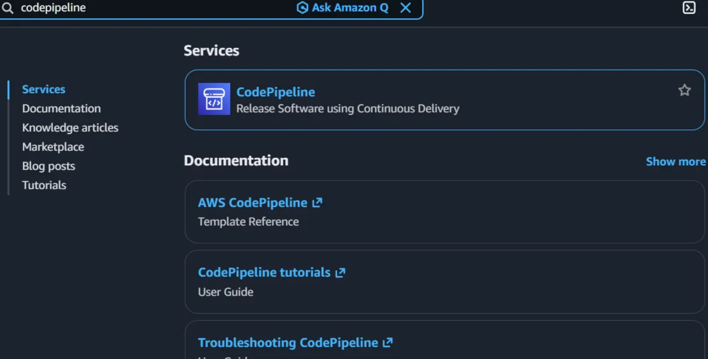

Click **Create pipeline**.

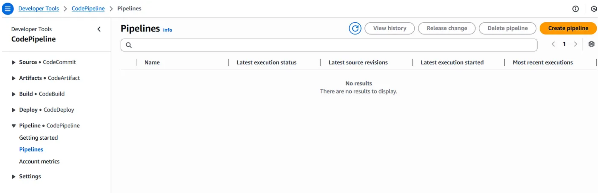

Under **Choose pipeline settings**, select Build **Custom pipeline**.

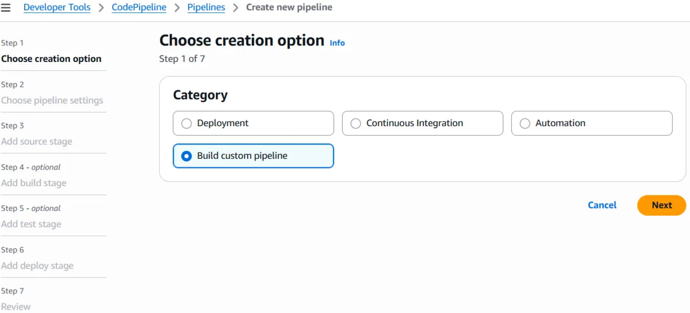

Click **Next** to continue.

**Choose Pipeline Settings**

**Pipeline name:** catpipeline

**Service role:** Select Create a new service role (AWS will auto-generate one)

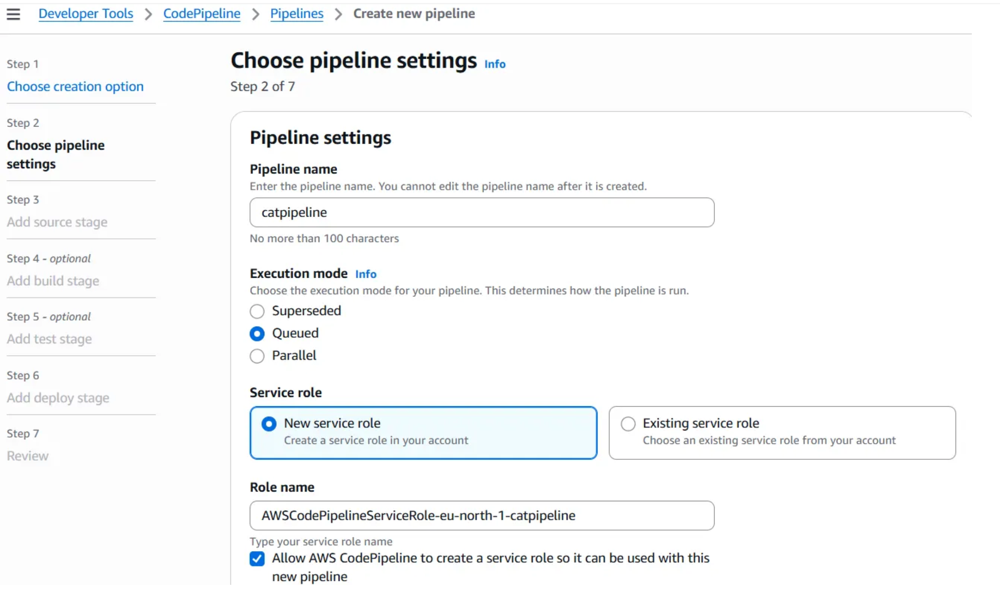

**Advanced settings:**

**Artifact store:** Default location

**Encryption key:** Default AWS-managed key

Click **Next** to continue.

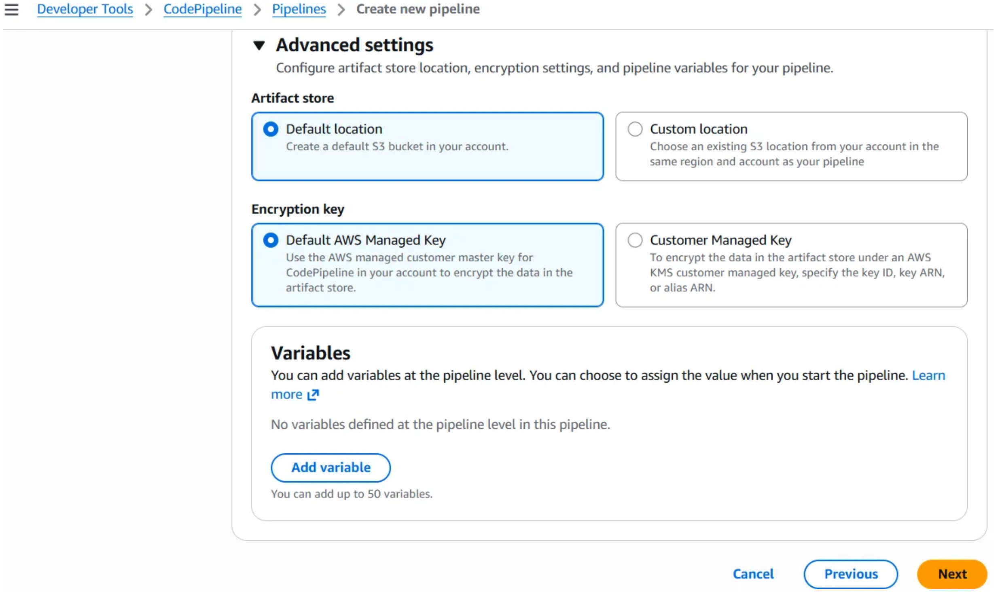

---

## Source Stage

**Source provider:** GitHub
**Connection:** Select your existing GitHub connection or create a new one if prompted and choose your project repository

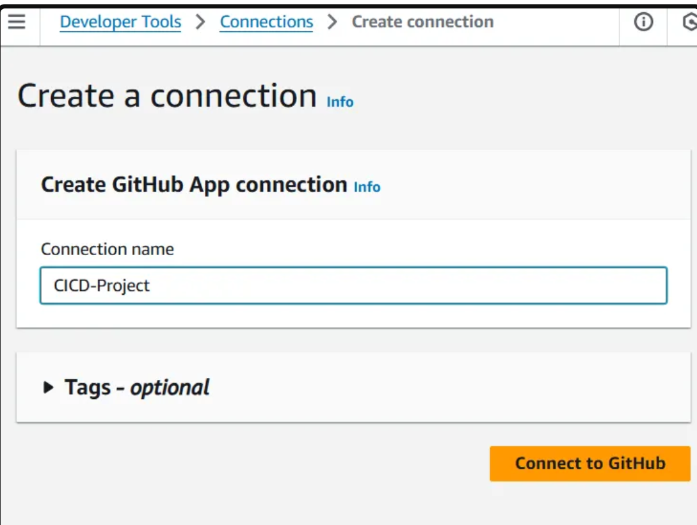

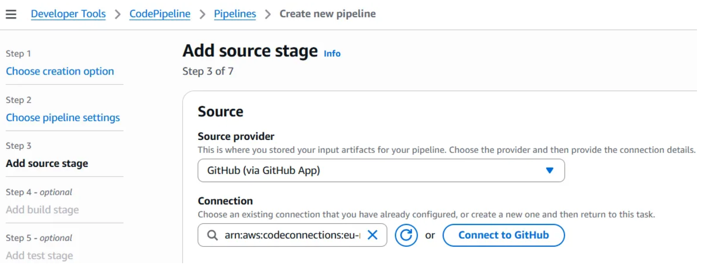

**Branch name:** Select your active branch (e.g., 'main')
**Detection options:** Enable Webhook to automatically trigger the pipeline on every push
**Output artifact format:** Keep the default

Click **Next** to continue.

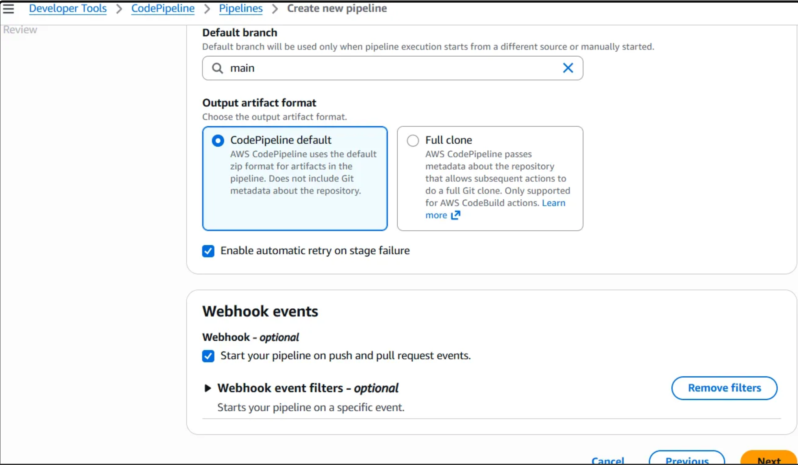

---

## Build Stage

**Choose Other Build Providers**

Choose AWS CodeBuild as your build provider and select your existing build project (e.g., *build_catepipeline)*

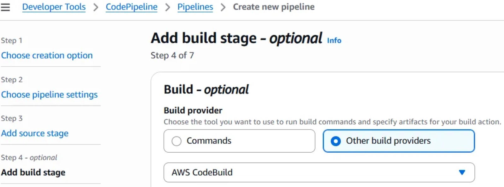

**Buildspec override:** Leave empty (uses your buildspec.yml)

**Environment variables:** Leave default unless required by your buildspec

**Build type:** Single build

**Region:** Select your working region (e.g., Europe (Stockholm))

**Input artifact:** SourceArtifact (from the Source stage)

**Optional:** Check Enable automatic retry on stage failure

Click **Next** to continue.

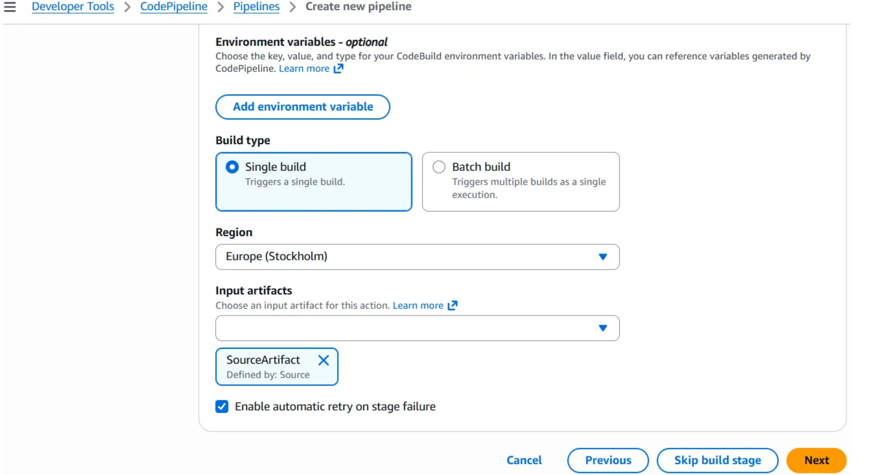

---

## Test Stage (Optional)

The Test stage lets you run automated tests on your application before it's deployed. This can catch bugs or issues early, improving reliability.

For small demo projects or simple web apps, running tests may not be necessary. Skipping speeds up the pipeline setup, allowing you to focus on building and deploying your containerized app. *So i skipped it...lol*

For production ready apps or larger projects, automated testing ensures your code works correctly before deployment.
You can integrate services like AWS CodeBuild tests, Selenium, or unit tests in this stage.

Skipping now is fine, but i can always add a Test stage later as the project grows.

---

## Deploy Stage

For now: Skip the Deploy stage. It will be configured in the next phase of the project.

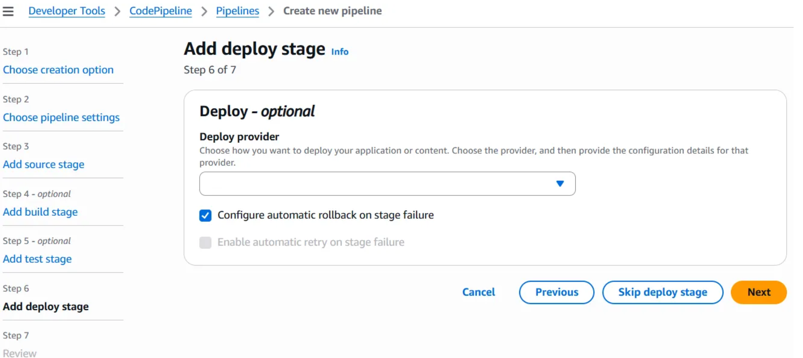

Click **Create pipeline** to finish setting up your pipeline.

Your pipeline is now created and ready to move through the Source and Build stages automatically when you push code.

---

## Test the Pipeline

Once the pipeline is created, it will automatically trigger an initial run.
Monitor the progress in the Build stage or wait for the execution to complete.
The generated artifacts are stored in the CodePipeline S3 bucket

**Add Permissions After Role Creation**

After Pipeline creation, Go to the IAM Console → Roles.
Find the CodePipeline service role created for your pipeline.
Click Add inline policy → JSON view and paste your permission JSON to grant the pipeline access to required AWS resources.

```json
{
  "Version": "2012-10-17",
  "Statement": [
    {
      "Effect": "Allow",
      "Action": [
        "ecs:RegisterTaskDefinition",   # Allow updating ECS task definitions
        "ecs:DescribeServices",         # Allow viewing ECS services
        "ecs:DescribeTaskDefinition",   # Allow viewing task definition details
        "ecs:UpdateService",            # Allow updating ECS services
        "ecs:DescribeClusters",         # Allow viewing ECS clusters
        "ecs:DescribeTasks",            # Allow viewing running tasks
        "ecs:ListTasks"                 # Allow listing ECS tasks
      ],
      "Resource": "*"
    },
    {
      "Effect": "Allow",
      "Action": [
        "ecr:GetAuthorizationToken",    # Allow authentication to ECR
        "ecr:BatchCheckLayerAvailability",
        "ecr:BatchGetImage",
        "ecr:PutImage",                 # Allow pushing images to ECR
        "ecr:InitiateLayerUpload",
        "ecr:UploadLayerPart",
        "ecr:CompleteLayerUpload"
      ],
      "Resource": "*"
    },
    {
      "Effect": "Allow",
      "Action": [
        "logs:CreateLogGroup",          # Allow creating CloudWatch log groups
        "logs:CreateLogStream",         # Allow creating log streams
        "logs:PutLogEvents"             # Allow sending log events
      ],
      "Resource": "*"
    },
    {
      "Effect": "Allow",
      "Action": "iam:PassRole",         # Allow passing IAM roles to ECS
```

This ensures CodePipeline has the necessary permissions to deploy your application correctly.

**Re-run the Pipeline**

Now that the necessary permissions are set, you can rerun your pipeline. After successful completion, you can visualize it.

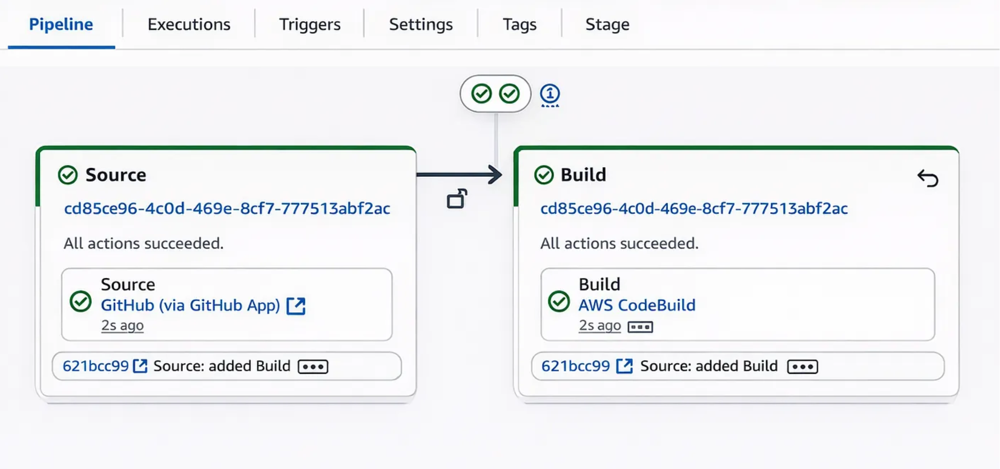

---

## Configure an Application Load Balancer (ALB)

Go to **EC2 → Load Balancers**

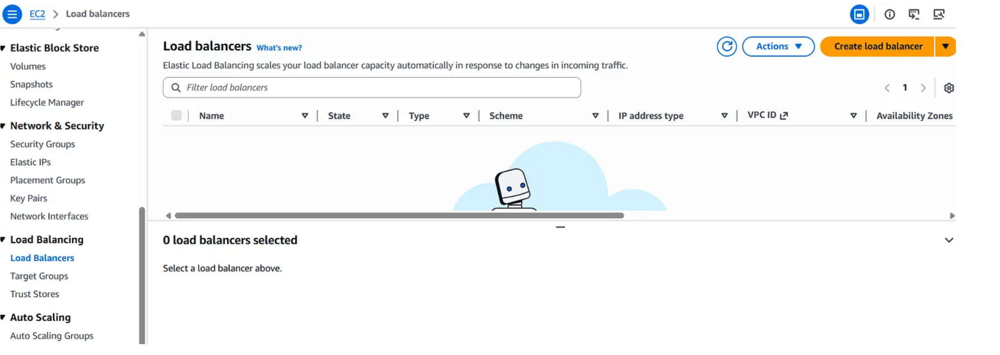

Click **Create Load Balancer → Application Load Balancer.**

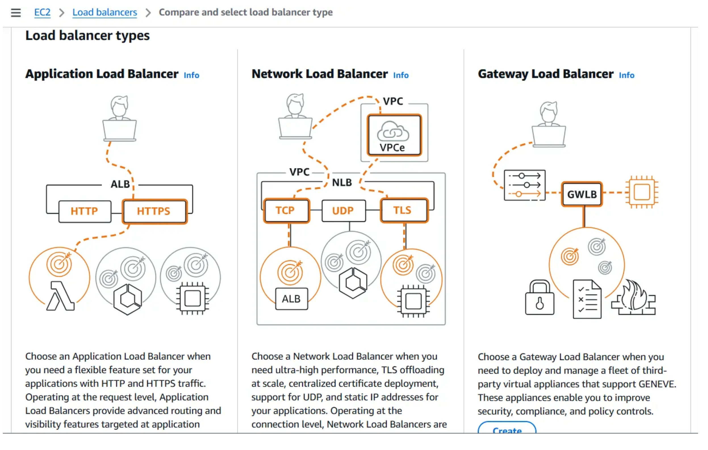

Name: **'catpipeline'**

Scheme: **Internet-facing**

Use **IPV4** Address Type

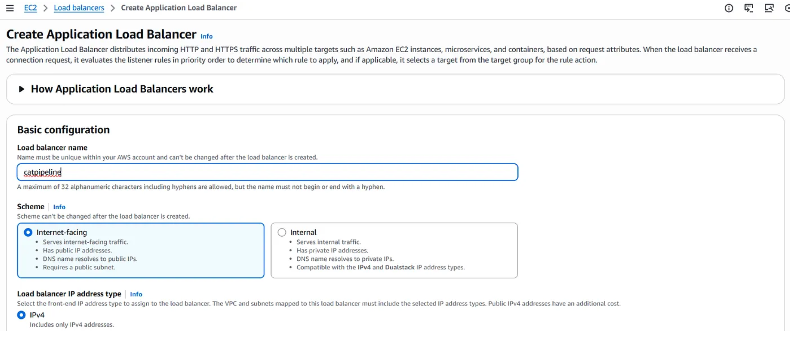

VPC: Select your default VPC
Subnets: Select all available subnets

This ALB will distribute traffic to your ECS tasks, ensuring high availability and smooth deployment.

**Configure Security Group and Target Group for ALB**

**Create Security Group:**

Name: **'catpipeline-SG'**
Inbound rule: **Protocol: HTTP. Port: 80. Source: 0.0.0.0/0**

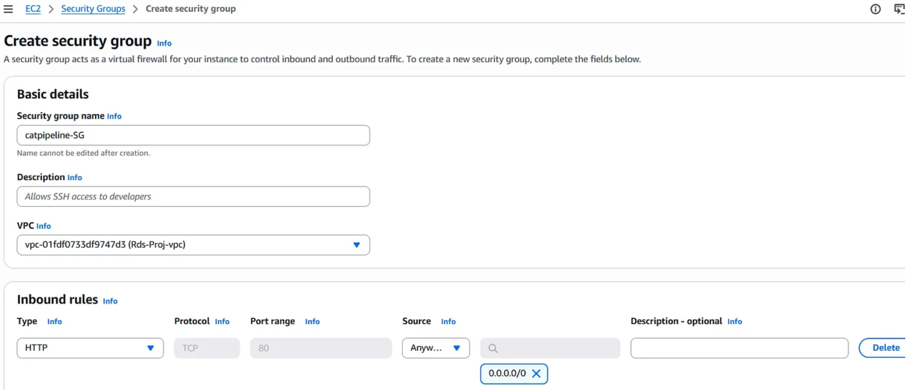

Configure Listeners: Ensure the ALB has a listener on **HTTP:80**

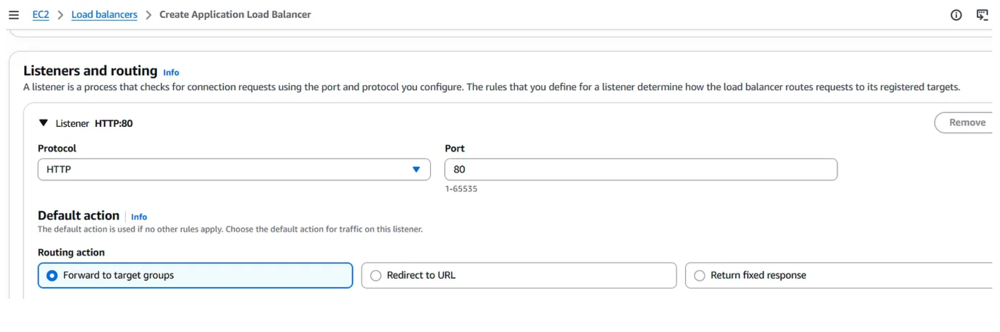

**Create Target Group:**

Name: 'catpipelineA-TG'
Type: **HTTP.** Port: **80**

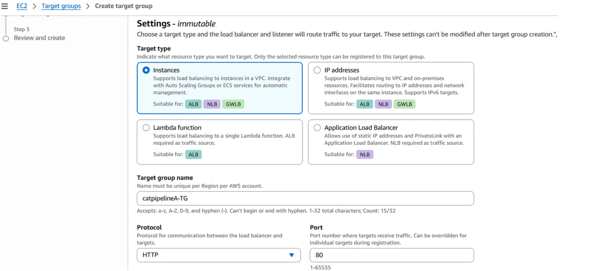

**Complete Creation of ALB:** This setup allows the ALB to route HTTP traffic to your ECS tasks running in Fargate.

---

## Create a Fargate Cluster

Open the ECS Console → Clusters → Create Cluster.
Cluster name: **'ecs_cluster_catpipeline_project'**

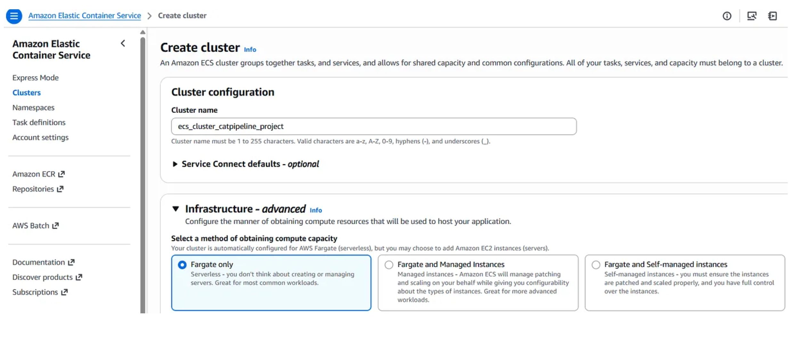

VPC: Select the default VPC
Subnets: Select all available subnets
Click Create to provision the cluster

This cluster will host your ECS Fargate tasks for the CI/CD pipeline deployment.

---

## Create Task and Container Definitions

Go to ECS → Task Definitions → Create new Task Definition
Name: 'catpipelinedemo'
Under Container Details:

Name: 'catpipeline'
Image URI: Copy the URI of your latest Docker image from **ECR**

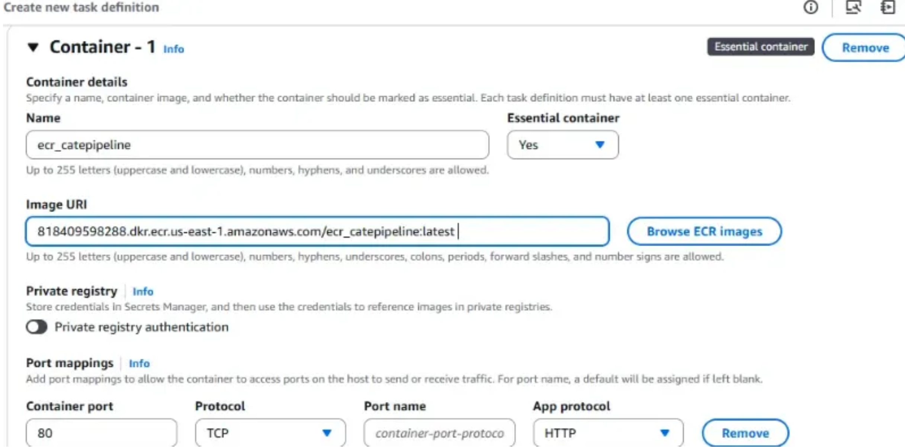

Also, choose **Linux/X86_64**, **0.5 vCPU**, and **1GB memory**. And under roles, select **ecsTaskExecutionRole** for both Task Role and Execution Role.

Click **Create:** This task definition tells ECS how to run your container, including which image to use.

---

## Deploy to ECS: Create a Service

From your ECS cluster, click Deploy → Create Service

Configure the service:

Launch type: FARGATE
Service name: `catpipelineservice`
Desired tasks: 2

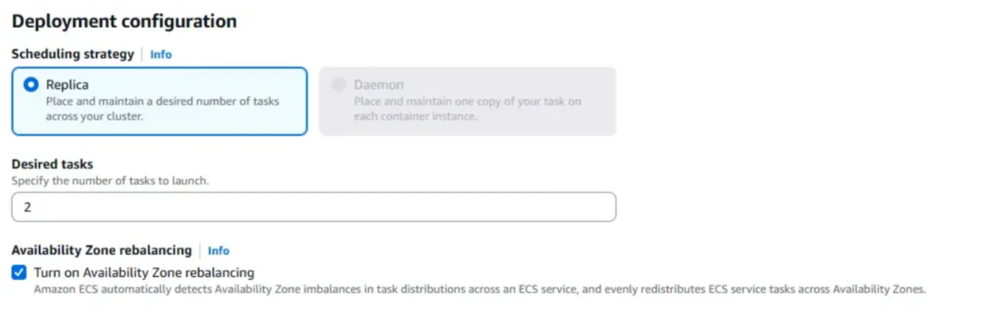

Deployment Controller Type: ECS

Use a Rolling Update

Load Balancer: 'catpipeline'
Target group: 'catpipelineA-TG'
Subnets: Select all available subnets

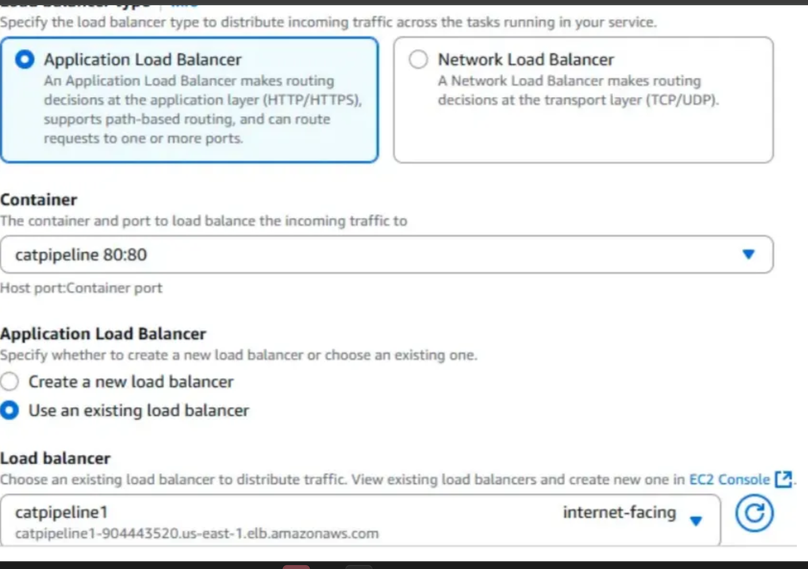

Security groups: Default + 'catpipeline-SG'
Public IP: Enabled

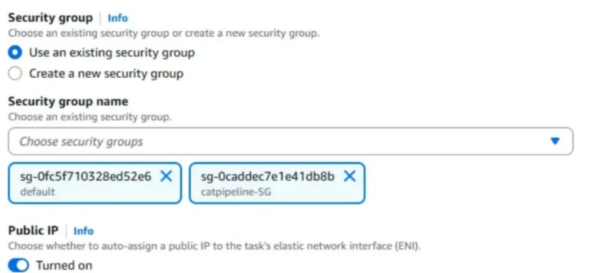

Use an Existing Listener:

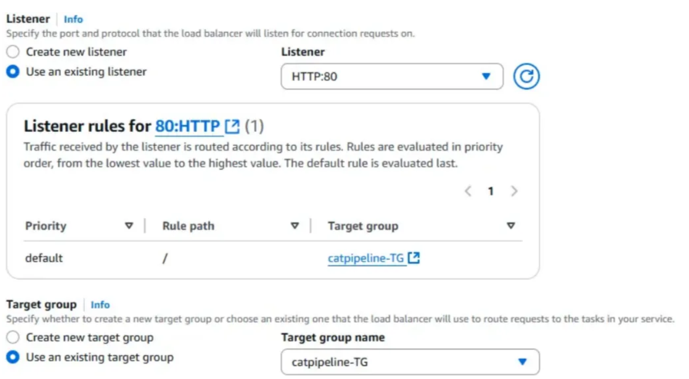

**Click Create:** This service will run your ECS tasks on Fargate and distribute traffic via the ALB.

---

## Verify Deployment

Once the ECS deployment completes, open the **Load Balancer DNS URL** in your browser.

Your **containerized web application** should now be live and accessible over the internet.

This confirms your **CI/CD pipeline** successfully built, pushed, and deployed your Docker container to ECS Fargate.

---

## Add Deploy Stage to CodePipeline

Open CodePipeline → catpipeline → Edit
Click + Add Stage → Deploy
Add an Action Group

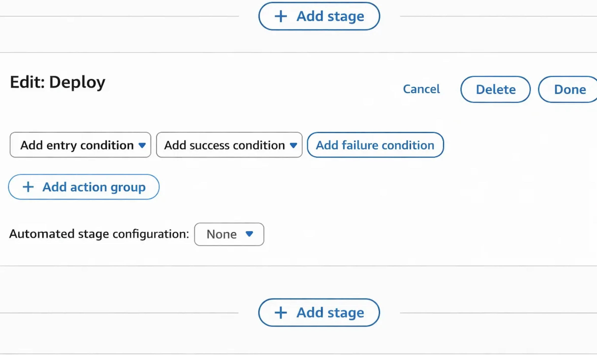

Use the following settings:

Provider: Amazon ECS
Cluster: 'ecs_cluster_catpipeline_project'
Service: 'catpipelineservice'
Input Artifact: 'BuildArtifact'
Image Definitions File: 'imagedefinitions.json'

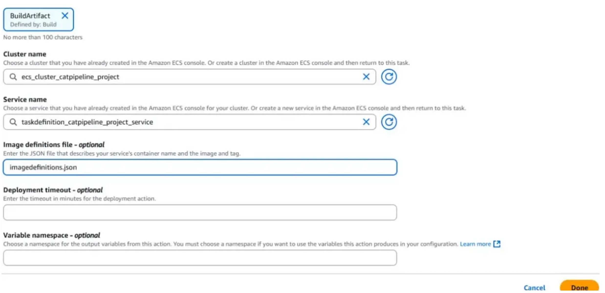

**Click Done and Save it.**

This adds the deploy stage so CodePipeline can automatically update ECS with your latest Docker image. Note that after adding the Deploy stage, you may see it marked as **"Didn't run"**. To trigger it, click the **"Release change"** button (highlighted in yellow) for the Deploy stage. This starts the deployment, and your ECS service will update with the latest Docker image.

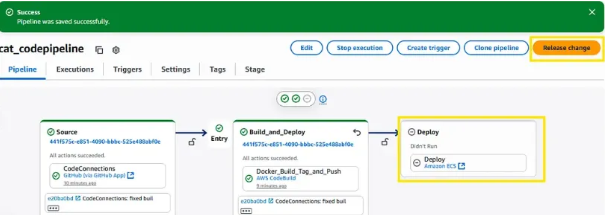

---

## Test the Automated Deployment

Edit your 'index.html' locally. For example, add '- with automation by imagedefinitions.json' to the header.

Push the changes to GitHub:

```bash
git add -A .
git commit -m "test pipeline"
git push
```

CodePipeline will automatically:

Detect the changes in GitHub
Trigger CodeBuild to rebuild the Docker image
Push the new image to ECR
Deploy the updated container to ECS Fargate

Your app will update automatically with the changes, confirming your CI/CD pipeline works end-to-end.

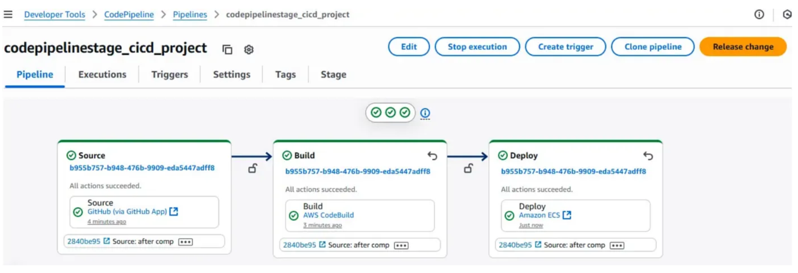

Refresh your **Application Load Balancer DNS URL** in your browser.

You should see the updated content, confirming the automated deployment was successful.

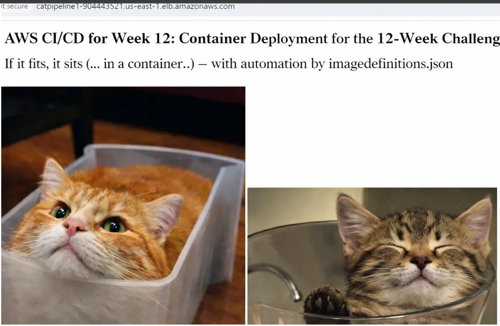

Your CI/CD pipeline now fully automates the process of building, pushing, and deploying Docker images, flowing seamlessly from GitHub → AWS CodeBuild → Amazon ECR → ECS Fargate. From code commit to live application, everything runs end to end without manual intervention.

---

## Acknowledgements

This project was completed with guidance from a knowledgeable colleague who chose to remain anonymous. Many thanks for the support.

Additional references were taken from the official AWS documentation.

---

## Maintainer

**ROLAND MAWULI AWUKU**

Roland Awuku is a cloud and security professional with a strong focus on building secure, scalable, and production-ready systems on AWS(5x Certified).

A long-form write-up of this build is also published [here](https://medium.com/@awukurolandmawuli/lets-build-a-fully-automated-ci-cd-pipeline-on-aws-ecs-fargate-using-codepipeline-codebuild-7d5f21121879).
